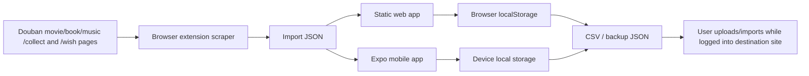

# Architecture

DoubanRefugee is local-first, backend-free, and export-first. The extension
scrapes Douban movie, book, or music user mark-list pages, specifically
`/collect` for completed items and `/wish` for wanted items. The canonical
media record lives in the browser or mobile app, and export renderers turn that
record into destination transfer files that the user uploads manually while
logged into each destination site.

## Components

- **Extension**: starts from a Douban user page, fetches the selected media
  type's `/collect` and `/wish` pages, follows pagination until each section
  ends or the safety limit is reached, then downloads or copies JSON.
- **Web app**: imports JSON or pasted HTML, stores the library in
  `localStorage`, and downloads export files.
- **Mobile app**: imports JSON or demo records, stores the library on device,
  and shares export text through the OS share sheet.
- **Canonical model**: one shared shape that includes Douban subject ID,
  collection status, marked date, consumed date, user rating, tags, short
  review/comment, source URL, poster URL, release date, creators, and countries
  when Douban exposes them.

## Deliberate Omissions

- No server API.
- No account system.
- No password collection.
- No backend login bridge for destination sites.
- No PostgreSQL or Redis.
- No background workers.
- No hosted backups.
- No paid metadata-provider keys.
