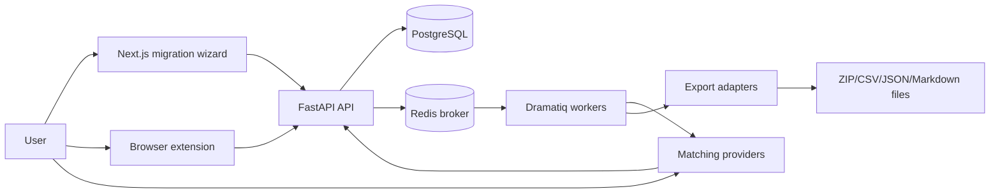

# Architecture

DoubanRefugee is built around a canonical media model. Ingestion, matching, and
destination exports depend on that model instead of depending on each other.

## Bounded Contexts

- **Ingestion**: Accepts browser-extension JSON, uploaded HTML, or optional
  Playwright snapshots. Produces canonical media items and backup snapshots.
- **Canonical library**: Stores normalized `MediaItem`, `Rating`, `Review`,
  `BackupSnapshot`, `MatchCandidate`, and `ExportJob` records.
- **Matching**: Uses layered exact, alternate-title, fuzzy, and metadata-assisted
  ranking. Manual overrides are persisted separately from provider results.
- **Exports**: Destination adapters transform canonical items into platform
  CSVs or archival bundles.
- **Privacy**: Sensitive session data is encrypted. Export artifacts can be
  short-lived and removed by retention jobs.

## Anti-Fragile Defaults

- Destination-specific logic lives in adapters.
- Source-specific quirks live in importers.
- Manual mappings improve later exports.
- Jobs are idempotent and persisted.
- Network providers are optional; lack of a provider degrades to review queue.

