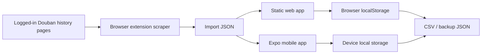

# Architecture

DoubanRefugee is local-first and backend-free. The extension scrapes a user's
own logged-in Douban history pages, the canonical media record lives in the
browser or mobile app, and export renderers turn that record into destination
transfer files.

## Components

- **Extension**: extracts the current Douban page or follows pagination from the
  current collection/history page, then downloads or copies JSON.
- **Web app**: imports JSON or pasted HTML, stores the library in
  `localStorage`, and downloads export files.
- **Mobile app**: imports JSON or demo records, stores the library on device,
  and shares export text through the OS share sheet.
- **Canonical model**: one shared shape for movies, books, and music.

## Deliberate Omissions

- No server API.
- No account system.
- No PostgreSQL or Redis.
- No background workers.
- No hosted backups.
- No paid metadata-provider keys.
