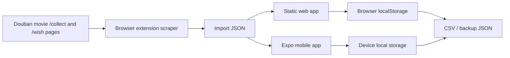

# Architecture

DoubanRefugee is local-first and backend-free. The extension scrapes Douban
movie user mark-list pages, specifically `/collect` for watched movies and
`/wish` for watchlist entries. The canonical media record lives in the browser
or mobile app, and export renderers turn that record into destination transfer
files.

## Components

- **Extension**: starts from a Douban movie user page, fetches `/collect` and
  `/wish`, follows pagination until each section ends or the safety limit is
  reached, then downloads or copies JSON.
- **Web app**: imports JSON or pasted HTML, stores the library in
  `localStorage`, and downloads export files.
- **Mobile app**: imports JSON or demo records, stores the library on device,
  and shares export text through the OS share sheet.
- **Canonical model**: one shared shape that includes Douban subject ID,
  collection status, marked date, watched date, user rating, tags, and short
  review/comment.

## Deliberate Omissions

- No server API.
- No account system.
- No PostgreSQL or Redis.
- No background workers.
- No hosted backups.
- No paid metadata-provider keys.
